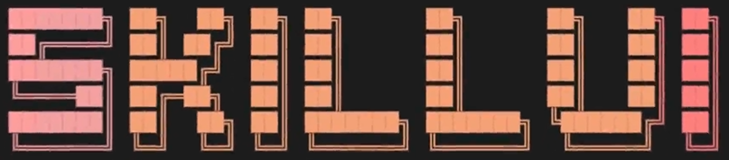

<div align="center">
  
</div>

<div align="center">

**Reverse-engineer any design system into a Claude-ready skill. Pure static analysis. No AI, no API keys.**

[](https://www.npmjs.com/package/skillui)
[](https://www.npmjs.com/package/skillui)
[](https://nodejs.org)
[](LICENSE)

</div>

---

## One-shotted Notion's landing page in minutes with a single line prompt

https://github.com/user-attachments/assets/4d6b63f1-8042-44a2-8f4f-a92fedadcaf9

---

## What is SkillUI?

**SkillUI** is a CLI that reverse-engineers the complete design system from any website, git repo, or local codebase — and packages it as a `.skill` file that Claude Code reads automatically.

Point it at any site and get:

- Exact color tokens, typography scale, spacing grid
- CSS keyframes, animation libraries, scroll triggers
- Hover/focus interaction state diffs
- Flex/grid layout structures
- DOM component fingerprints
- 7 cinematic scroll journey screenshots
- Google Fonts bundled locally

All packaged into an output folder with `CLAUDE.md` + `SKILL.md` so Claude picks up the entire design context the moment you open it.

---

## Install

```bash
npm install -g skillui
```

Requires **Node.js 18+**

For ultra mode (full visual extraction):

```bash
npm install playwright
npx playwright install chromium
```

---

## Quick Start

```bash
# Extract a design system from any URL
skillui --url https://notion.so

# Open the output folder in Claude Code
cd notion-design && claude

# Ask Claude to build your UI
"Build me a landing page that matches this design system"
```

Claude automatically reads `CLAUDE.md` and `SKILL.md` from the folder and generates an HTML file matching the exact visual language of the site.

---

## Modes

### Default mode

Pure static analysis — HTML, CSS, fonts, color tokens, spacing, typography.

```bash
skillui --url https://linear.app
```

### Ultra mode

Full cinematic extraction using Playwright — scroll screenshots, interaction diffs, animation detection, layout analysis, DOM component fingerprinting.

```bash
skillui --url https://linear.app --mode ultra
```

### Dir mode

Scan a local project for design tokens, Tailwind config, CSS variables, component patterns.

```bash
skillui --dir ./my-app
```

### Repo mode

Clone any public git repo and run dir mode automatically.

```bash
skillui --repo https://github.com/org/repo
```

---

## Output Structure

```
notion-design/
├── notion-design.skill       # Packaged .skill ZIP (contains everything)
├── SKILL.md                  # Master skill file (auto-loaded by Claude)
├── CLAUDE.md                 # Claude Code project instructions
├── DESIGN.md                 # Full design system tokens
├── references/
│   ├── ANIMATIONS.md         # Motion specs and keyframes
│   ├── LAYOUT.md             # Layout containers and grid
│   ├── COMPONENTS.md         # DOM component patterns
│   ├── INTERACTIONS.md       # Hover/focus state diffs
│   └── VISUAL_GUIDE.md       # All screenshots embedded in sequence
├── screens/
│   ├── scroll/               # 7 scroll journey screenshots
│   ├── pages/                # Full-page screenshots (ultra)
│   └── sections/             # Section clip screenshots (ultra)
├── tokens/
│   ├── colors.json
│   ├── spacing.json
│   └── typography.json
└── fonts/                    # Bundled Google Fonts (woff2)
```

---

## All Flags

```
skillui --url <url>           Crawl a live website
skillui --dir <path>          Scan a local project directory
skillui --repo <url>          Clone and scan a git repository

--mode ultra                  Enable cinematic extraction (requires Playwright)
--screens <n>                 Pages to crawl in ultra mode (default: 5, max: 20)
--out <path>                  Output directory (default: ./)
--name <string>               Override the project name
--format design-md|skill|both Output format (default: both)
--no-skill                    Output DESIGN.md only, skip .skill packaging
```

---

## What You Get

| Feature | Default | Ultra |
|---|:---:|:---:|
| Color tokens | ✅ | ✅ |
| Typography scale | ✅ | ✅ |
| Spacing grid | ✅ | ✅ |
| CSS variables | ✅ | ✅ |
| Font bundles | ✅ | ✅ |
| CLAUDE.md + SKILL.md | ✅ | ✅ |
| Scroll journey screenshots | | ✅ |
| Interaction state diffs | | ✅ |
| Animation detection | | ✅ |
| Layout extraction | | ✅ |
| DOM component fingerprinting | | ✅ |

---

## Examples

```bash
# Full ultra extraction — Nothing.tech
skillui --url https://nothing.tech --mode ultra --screens 10

# Scan a local Next.js app
skillui --dir ./my-nextjs-app --name "MyApp"

# Clone and analyze a public repo
skillui --repo https://github.com/vercel/next.js --name "Next.js"

# Output only DESIGN.md, no .skill packaging
skillui --url https://stripe.com --format design-md

# Save to a specific directory
skillui --url https://linear.app --out ./design-systems
```

---

## How It Works

SkillUI uses pure static analysis. No AI, no API keys, no cloud.

- **URL mode** — fetches HTML, crawls all linked CSS, extracts computed styles via Playwright DOM inspection
- **Dir mode** — scans `.css`, `.scss`, `.ts`, `.tsx`, `.js`, `.jsx` for design tokens, Tailwind config, CSS variables, and component patterns
- **Repo mode** — clones to a temp directory and runs dir mode
- **Ultra mode** — runs Playwright to capture scroll screenshots, detect animation libraries from `window.*` globals, extract `@keyframes` from `document.styleSheets`, capture hover/focus state diffs, fingerprint DOM components

---

## Requirements

- Node.js 18+
- For `--mode ultra`: Playwright (`npm install playwright && npx playwright install chromium`)

---

## Links

- [npm package](https://www.npmjs.com/package/skillui)
- [Landing page](https://skillui.vercel.app)

---

## License

MIT
